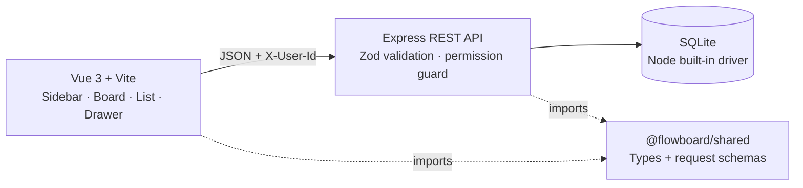

# Flowboard

Flowboard is a mini project-management app for one workspace. It combines a permission-filtered hierarchy, per-list status workflows, a kanban board, a sortable list, and a focused task drawer.

## Run locally

Requirements: Node.js 22.5+ and npm 10+.

```bash
npm install
npm run dev
```

`npm run dev` applies migrations, seeds an empty database, and starts:

- Web: http://localhost:5173
- API: http://localhost:4000

If `make` is available, `make dev` is an exact convenience alias. Existing database contents are preserved; use `npm run db:reset` to replace them with the demo data.

Other commands:

```bash
npm test
npm run typecheck
npm run build
```

## Architecture



The npm-workspaces monorepo separates `apps/web`, `apps/api`, and `packages/shared`. The API owns authorization and never relies on filtered client state for protection. SQLite keeps the reviewer setup service-free; migrations are checked into `apps/api/migrations`.

## Data model

- `containers` stores the workspace tree with `type`, `parent_id`, sibling `position`, `visibility`, and `archived_at`.
- Valid edges are workspace → space → folder → list. Lists contain tasks, not containers.
- Each list owns ordered `statuses`. A task's `status_id` must belong to its `primary_list_id`.
- New lists are initialized transactionally with To do, In progress, and Done statuses.
- `tasks` are ordered within a `(list, status)` column. `task_assignees` supplies the many-to-many user relation.
- `grants` attach one `allow` or `deny` rule to a user and container.

Containers are archived rather than destroyed. An archived ancestor hides its subtree; restoring it reveals descendants unless they were archived independently. Tasks are permanently deleted.

Position-changing operations run transactionally and normalize siblings back to contiguous integer positions. Restoring an active container is rejected with `409`.

## Permission model

Alice is an admin and bypasses grants. For members, Flowboard evaluates the target container upward:

1. The nearest explicit `allow` or `deny` wins.
2. A private container is an implicit deny at its level.
3. A specific descendant allow can therefore reopen a path beneath an ancestor deny/private boundary.
4. Public resources default to visible when no closer rule or private boundary applies.

The tree includes redacted ancestor shells needed to navigate to an allowed descendant. Shells are named **Restricted**, expose no original name/content, and cannot be opened. Direct access is still checked independently.

Task assignment and resource access are intentionally separate. Assigning a user does not grant access to the task's list; the task drawer warns when a selected assignee cannot see the destination list. Admins manage explicit grants in **Workspace settings**.

An extension for teams would add grant subjects (`user | team`), membership tables, and a computed effective-access cache while retaining nearest-rule precedence.

### Seeded user matrix

| User | Role | What the seed demonstrates |
|---|---|---|
| Alice | admin | Sees and edits all Engineering and Product content. |
| Bob | member | Engineering is denied and Q2 Launch is private, but a specific allow reopens Backlog. He sees redacted ancestor shells plus Backlog; Current Sprint and Product remain hidden. |
| Carol | member | An allow opens the private Product branch and Discovery folder, while a specific deny hides the otherwise-public Product Roadmap list. |

## Reviewer demo

1. Start with `npm run dev` (or `make dev`).
2. Select **Alice** and confirm the complete workspace tree is visible.
3. Select **Bob** and confirm a Restricted → Restricted path leads to Backlog.
4. Select **Carol** and confirm Product and Discovery are visible while Product Roadmap is absent.
5. Return to Alice, select a list, create a task, and drag it to another status.
6. Open the task drawer, change its title, priority, assignees, or due date, and save.
7. Switch to List view and verify the updated task. Sort by due date or priority.
8. Open **Workspace settings** as Alice to create/archive/reorder containers, configure statuses, and add or remove member grants.

## API overview

Every `/api` request requires `X-User-Id: alice|bob|carol`. Responses use `{ "data": ... }`; paginated endpoints also include `meta`. Errors always use `{ "error": { "code", "message" } }`.

| Method | Endpoint | Purpose |
|---|---|---|
| GET | `/api/users` | Mock workspace users |
| GET | `/api/tree` | Permission-filtered hierarchy |
| GET/PUT/DELETE | `/api/grants`, `/api/grants/:resourceId/:userId` | List and manage explicit grants (admin) |
| GET | `/api/containers/:id/access` | Effective access matrix for assignment guidance |
| GET | `/api/containers/archived` | Archived containers available for restore (admin) |
| POST/PATCH | `/api/containers`, `/api/containers/:id` | Create/update containers (admin) |
| POST | `/api/containers/:id/move` | Reparent or reorder a container (admin) |
| DELETE/POST | `/api/containers/:id`, `/api/containers/:id/restore` | Archive/restore container |
| GET/POST | `/api/lists/:listId/statuses` | List statuses; create statuses as admin |
| PATCH/DELETE | `/api/statuses/:id` | Update/delete status (admin) |
| PUT | `/api/lists/:listId/statuses/reorder` | Reorder all list statuses (admin) |
| GET/POST | `/api/lists/:listId/tasks` | Paginated task list/create |
| GET/PATCH/DELETE | `/api/tasks/:id` | Task details/update/delete |
| POST | `/api/tasks/:id/move` | Move across status/list and reorder |

Task pagination uses `offset` and `limit` (maximum 100). Sorting supports `sort=dueDate|priority|position` and `direction=asc|desc`. The web client follows pagination metadata until all tasks for the selected list are loaded.

### HTTP status contract

| Status | Meaning |
|---|---|
| `401` | Missing or unknown `X-User-Id` |
| `403` | Resource exists but the user cannot access it |
| `404` | Resource does not exist |
| `409` | Invalid state transition, such as restoring an active container or deleting an in-use/final status |
| `422` | Request shape, hierarchy, status/list, assignee, or field validation failure |

## Trade-offs and week two

- Offset pagination is intentionally simple for the seeded scale.
- HTML drag-and-drop avoids a heavy dependency; week two would add keyboard reordering and touch support.
- The MVP permanently deletes tasks and has no restore/history screen.
- Cross-list movement is available from the task drawer; board drag-and-drop remains scoped to the selected list.
- One-level subtasks, real-time collaboration, audit history, richer grant subjects, cursor pagination, broader Playwright coverage, and responsive mobile layouts are next.
